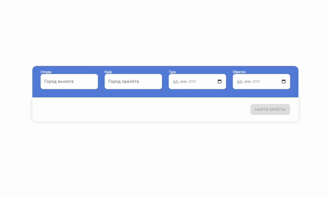

# AVIASALES

## :gear: Установка
* склонируйте сборку: ```git clone https://github.com/rBakirovv/aviasales.git```
* перейдите в скачанную папку со сборкой: ```cd aviasales```
* скачайте необходимые зависимости: ```npm i```
* чтобы начать работу, введите команду: ```npm run dev``` (режим разработки)
* чтобы собрать проект, введите команду ```npm run build``` (режим сборки)

## :hammer: Технологии
* Next.js
* MobX
* Material UI

## :open_file_folder: Файловая структура
```
├── public
  ├── images - картинки
  ...
├── src
  ├── components - React компоненты
    ├── Result - билеты
    ├── SearchFrom - форма поиска
    ├── UI
      ...
    ...
  ├── data 
    ├── flightData.ts - данные авиарейсов
  ├── fonts - шрифты
  ├── pages - страницы
  ├── store - state-менеджер
  ├── styles - глобальные стили
...
```




